# TOTAL GUITAR
(Developer: Roman Rakic)

.webp)

[TOTAL GUITAR>>>Live webpage](https://rockroman.github.io/CI_PP2_TG/)

## Table of Content
#
0. [Introduction](#introduction)
1. [Project Goals](#project-goals)
    - [User Goals](#user-goals)
    - [Site Owner Goals](#company-goals)
2. [User Experience(UX)](#user-experienceux)
    - [Ideal User](#ideal-user)
    - [User Requirements and Expectations](#user-requirements-and-expectations)
    - [User Stories](#user-stories)
3. [Design](#design)
    - [ Chosen Design](#chosen-design)
    - [Wireframes](#wireframes)
    - [Colour Scheme](#colour-scheme)
    - [Fonts](#fonts)
    - [Structure](#structure)
    
4. [Technologies Used](#technologies-used)
    - [Main Languages Used](#languages)
    - [Frameworks Libraries & Programs Used](#frameworks-libraries--programs-used)
5. [Features](#features)
     - [Existing-features](#existing-features)
     - [Features to implement in future](#features-to-implement-in-future)

6. [Testing](#testing)
    - [HTML Validation](#html-validation)
    - [CSS Validation](#css-validation)
    - [Accessibility](#accessibility)
    - [Performance](#performance)
    - [Device testing](#device-testing)
    - [Browser compatibility](#browser-compatability)
    - [Testing user stories](#testing-user-stories)
8. [Bugs](#bugs)
9. [Deployment](#deployment)
   - [Deploying on GitHub pages](#deploying-on-github-pages)
   - [Local Development](#local-development)
     * [How to Fork](#how-to-fork)
     * [How to Clone](#how-to-clone) 
10. [Credits](#credits)
11. [Acknowledgments](#acknowledgments)

## Introduction

Total Guitar is small interesting two part javascript game,
that brings together reaction and knowledge game based on world of guitar and Rock n' roll.
With fun fast and interesting game concept users will be taken into the world of guitar.
Targeted user is anyone with interest in the guitar  instrument and highlights in history related to
it.Project is developed as part of  five milestone projects for acquiring the "Diploma In Software Development" with Code institute.
Requirements of this project is showing the use of Javascript and showcasing interactiveness of web-site or web application.

## Project Goals 

Goal of this project is creating interactive game with clear content ,that is user friendly, uniqe, fun and challenging.

### User Goals

- Pick up fun interactive and fun game to play
- To engage and be challenged in different type of skills
- Be able to learn something while playing. 

### Site Owner Goals

- Develop unique and interesting game
- Provide fun fast and interactive content
- Incorporate fun and challenges
- Make design simple and user-friendly
- Make game responsive and accessible
- Give clear feedback to User

[Back to top &uarr;](#total-guitar)

## User Experience(UX)

### Ideal User

- Anyone with musical interest
- People who want to be entertained and challenged at the same time
- Any user who besides interesting and fun content has desire to learn something

### User Requirements and Expectations

- Simple and appealing design
- Clear and set rules
- User friendly navigation
- Responsiveness on range of devices
- Notifications and feedback to be clear and brief
- A way to get in touch with developer
- Having an option to leave feedback
- Meaningful   and logical presentation of project's content 

### User Stories

####  First time (App User)
0. I want to understand what the game is about
1. I want to game rules to be easy to understand 
2. I want to know the controls in a game
3. I want to game to be fun and interactive
4. I want to be able to see the progress Im making throughout  the game
5. I want to game to be challenging
6. I want to be able to get in touch with developer 
7. I want to be able to leave feedback
8. I want to game to be responsive no matter what device is played on.

#### Returning User
9. I want to learn something playing the game
10. I want to be able to restart the game when i finish
11. I want game to be fast and dynamic so i can recommend it to my friends 
12. I want to have more than one option to get in touch with developer
13. I want to know that my feedback has been sent

[Back to top &uarr;](#total-guitar)

## Design

### Chosen design

For this project I decided to go with musical theme background with stage and
guitar based background keeping the color pallet simple and in line with project concept and content.  

### Wireframes

***

Mobile-wireframes

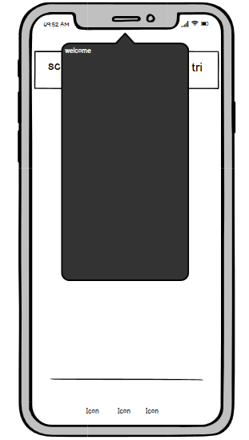
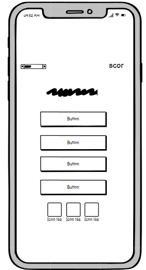

Tablet-wireframes

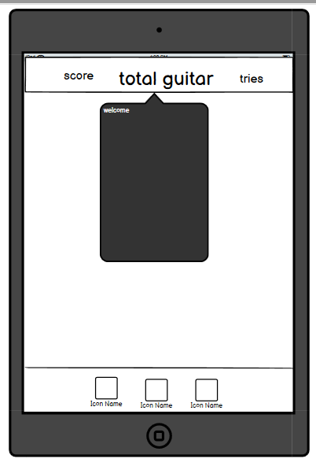
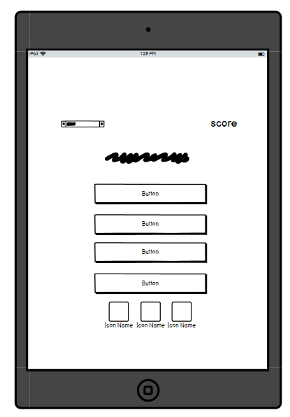

Desktop-wireframes

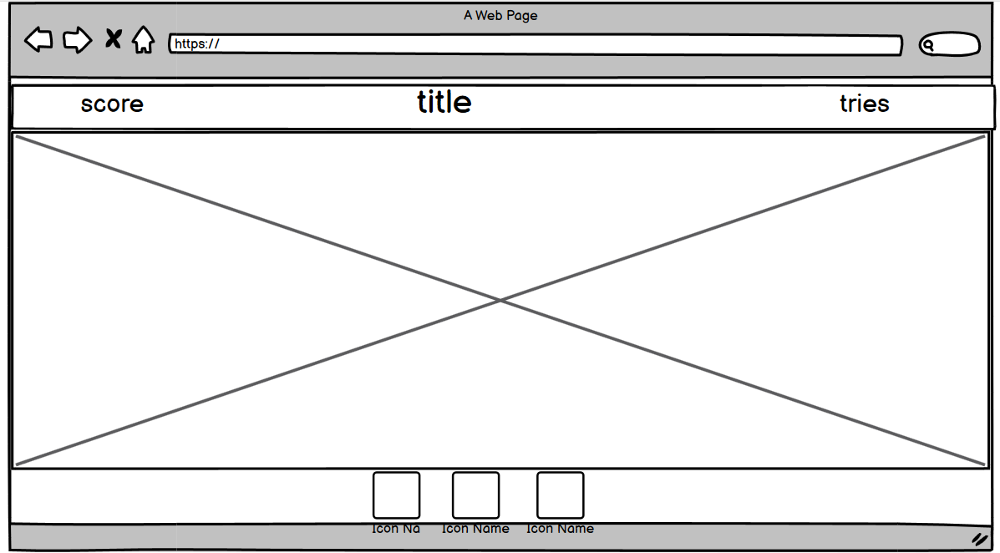
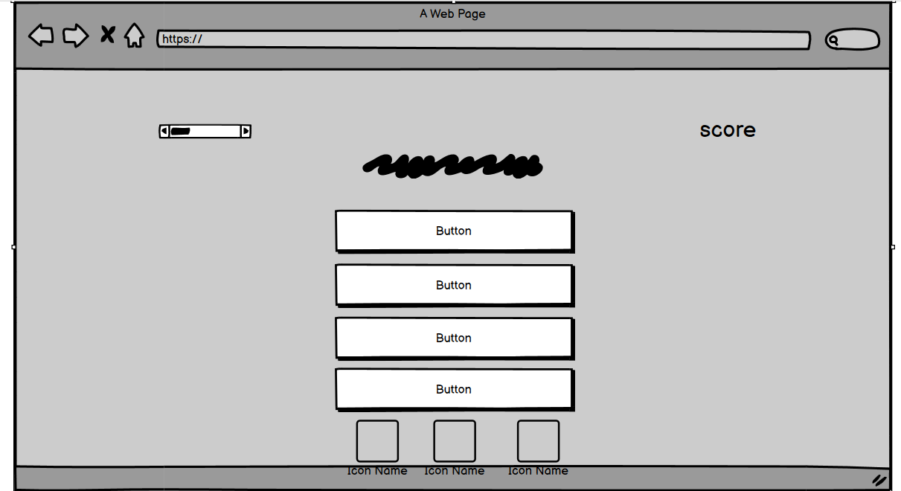

### Colour Scheme

- Color Pallete was custom made on [Coolors.co](https://coolors.co) 

 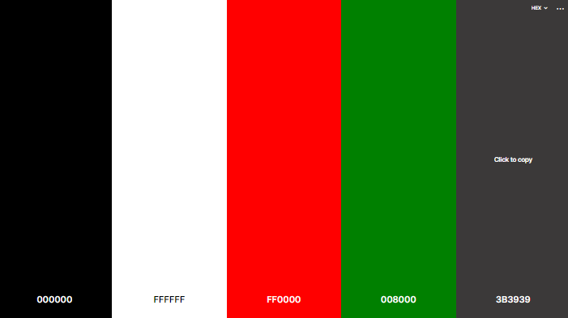

### Fonts

- Google Fonts were implemented on the website.I used  'Amaranth' font that has slight curves and makes the lettering eye-catching.this font family is Thick Sans font which has tidy letter and Smooth finishes.

 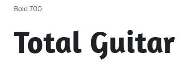

### Structure

- Structure implemented for this project is user friendly,easy to navigate with 2 separate screens for each type of the 
game with intelligently  designed pop up modals that are guiding the user and  offering feedback while progressing through 
games.

- project consists of folowing screens:
  
  - Welcome screen with pop up modal that welcomes user and presents the content of a Project
  - 2nd pop up modal with first game rules and button that initiates the game
  - First game main screen with game field ,target and custom,made aiming cursor
  - game over modal or transition modal depending on outcome of the game one will direct user to a 2nd game while other 
  will greet user and offer a chance to play again
  - main 2nd game screen that is presented to user with buttons offering answers to a question ,question himself and 
  quiz stats section with progress bar and points counter
  - Thank you form that which allows user to give feedback to a developer 

 

## Technologies Used

### Languages
- HTML5
- CSS
- Javascript

### Frameworks Libraries & Programs Used
- [Gitpod](https://www.gitpod.io/)
- [GitHub](https://github.com/)
- [Bootstrap 5](https://getbootstrap.com/)
- [Git](https://git-scm.com/)
- [Tiny.png](https://tinypng.com/)
- [Font Awesome](https://fontawesome.com/)
- [Balsamiq](https://balsamiq.com/)
- [Coolors.co](https://coolors.co) 
- [Google Fonts](https://fonts.google.com/)
- [JShint](https://jshint.com/)
- [Jpg. to Webp converter](https://convertio.co/jpg-webp/)
- [Am I Responsive](http://ami.responsivedesign.is/)
- [EmailJS](https://www.emailjs.com) 
- [Favicon.io](https://favicon.io)

[Back to top &uarr;](#total-guitar)

## Features

 

### Existing Features

### Favicon
- small icon or collection of icons associated with a website, web page, or web application in this case I took a custom-made company logo
- user story covered:11

See feature

### Navigation
- game modals that guides user in his progress through the project
- user story covered: 0,1,2

See feature

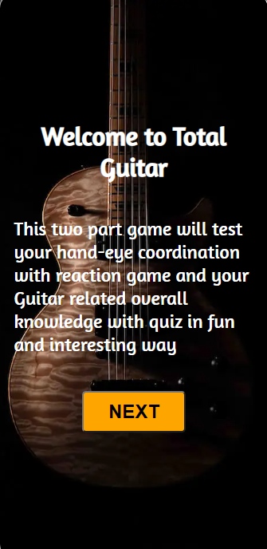

See feature

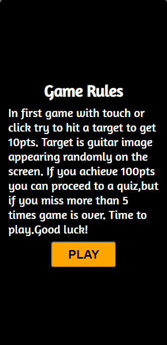

See feature

See feature

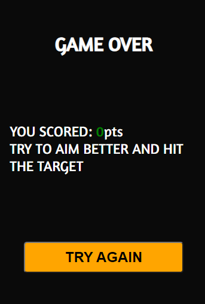

### Welcome pop up modal
- presents project to a user
- user story covered: 0

See feature

### Rules and start game modal
- Introduces rules of the game to a user and user can initiate the game 
with a play button
- user story covered: 2,3

See feature

### 1st game main screen
- screen where user is playing his first game
- user story covered: 5,11

See feature

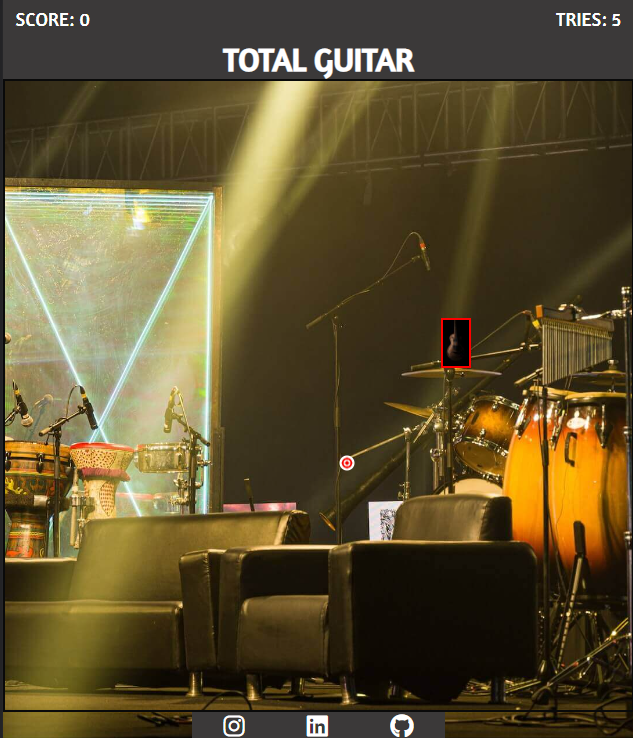

### header with game stats
- Displays users progress during the game
- user story covered: 4

See feature

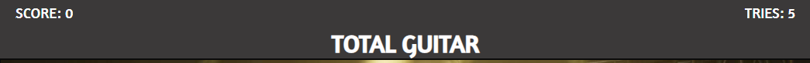

### Hit identifier
- Gives notification to user that target has been hit
- user story covered: 4,3

See feature

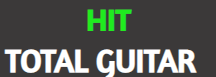

### Target
- Image that user is trying to click on the screen
- user story covered: 3,11

See feature

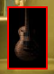

### Custom cursor
- Cursor that user is aiming with to click onto Target
- user story covered: 3,11

See feature

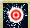

### Game over modal
- gives feedback to user that game is over and provides the score and option to play again
- user story covered: 10

See feature

### Transition modal
- User is notified that he can proceed to quiz game
- user story covered: 0

See feature

### quiz game main screen
- Main quiz game screen
- user story covered: 5,9

See feature

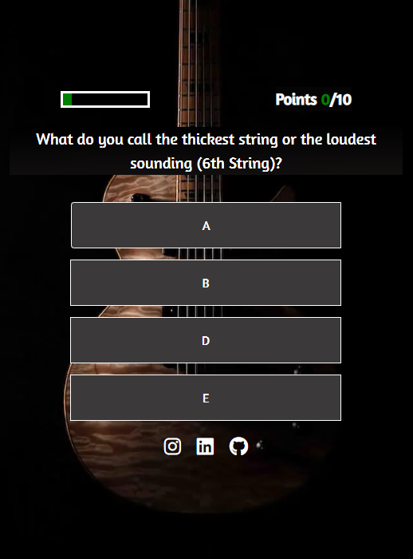

### quiz stats
- Notifies user about current progress in game
- user story covered: 4

See feature

### end quiz button
- User can end quiz with this button
- user story covered: 10

See feature

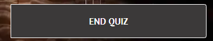

### Thank-you form
- Allows user to leave a feedback related to game
- user story covered: 10

See feature

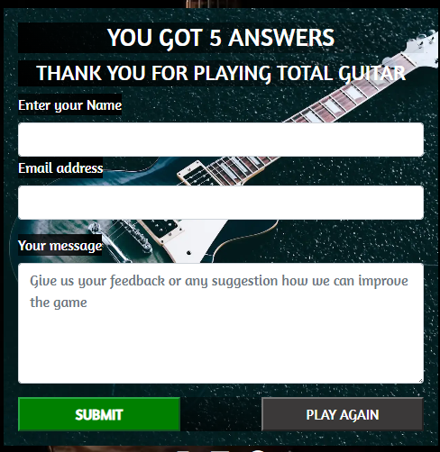

### Thank-you message
- Notifies user that his feedback was successfully sent
- user story covered: 13

See feature

### Footer
- Gives option to user to contact Developer
- user story covered: 12

See feature

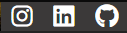

## Features to implement in future

- Increase the number of targets that will make game even more challenging
- Make a dummy target to make user even more focused
- Introduce more variety into questions

## Testing

### HTML Validation
 
Testing was taken during entire development process utilizing Chrome developer tools and at the end when project was finished.
W3C Markup Service was used to validate the HTML of the website and all code passed with no errors to show. 

Index.html

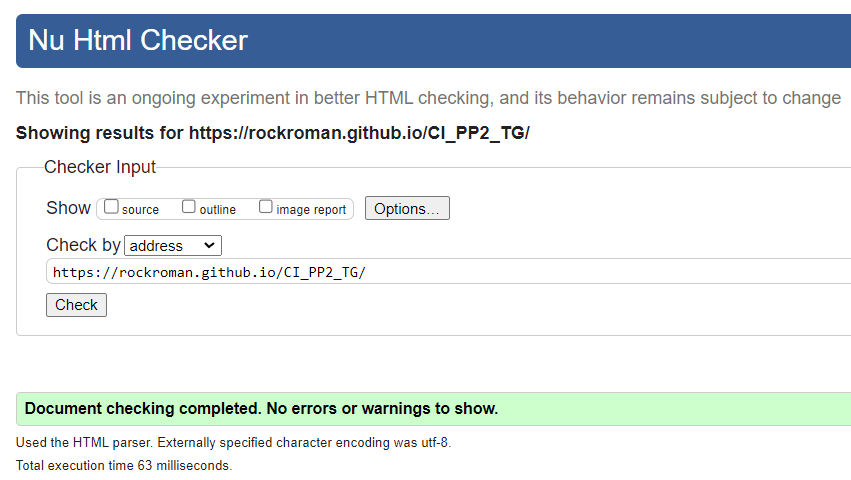

quiz.html

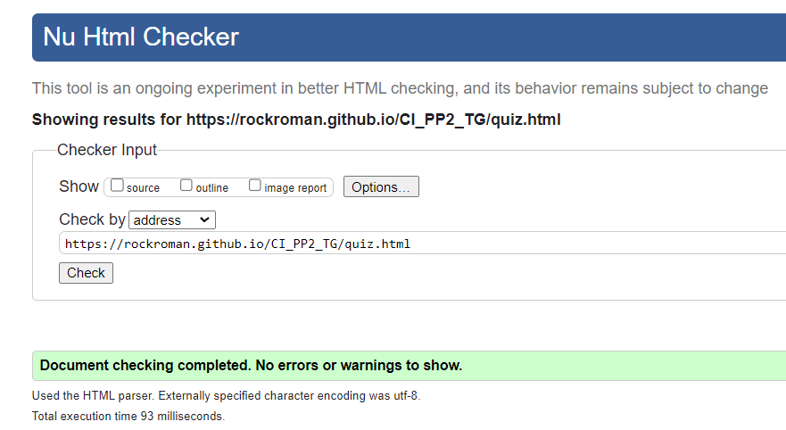

404 page

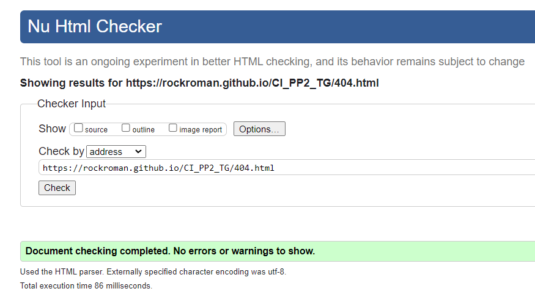

[Back to top &uarr;](#total-guitar)

### CSS Validation

***
 The  W3C Jigsaw CSS Validation Service was used to test css code of website.this validator showed no errors.

Css

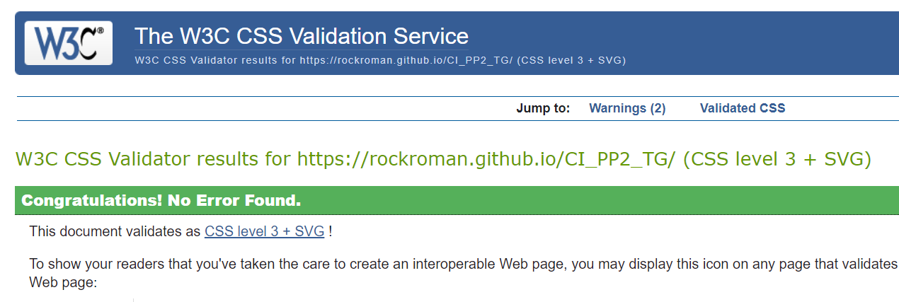

### JavaScript Validation
 JSHint Javascript Validation Service was used to validate the Javascript files. No significant issues were found.

main.js

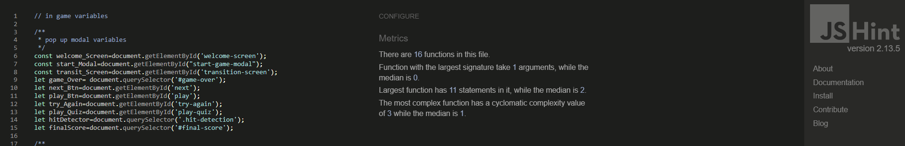

quiz.js

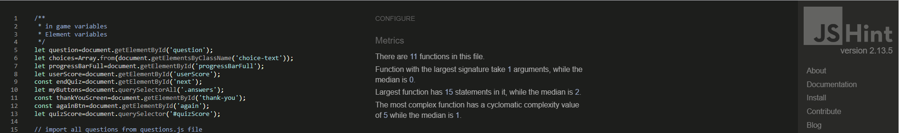

questions.js

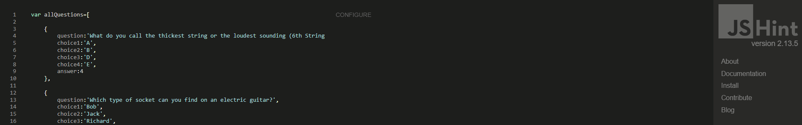

contact.js

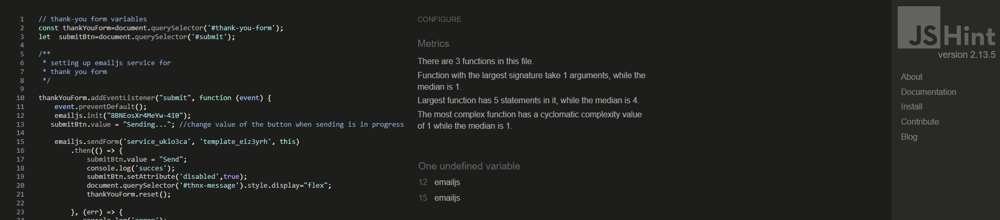

### Accessibility

I used  WAVE WebAIM web accessibility evaluation service to ensure the project's high standards regarding accessibility.
everything passed with 0 errors

Homepage

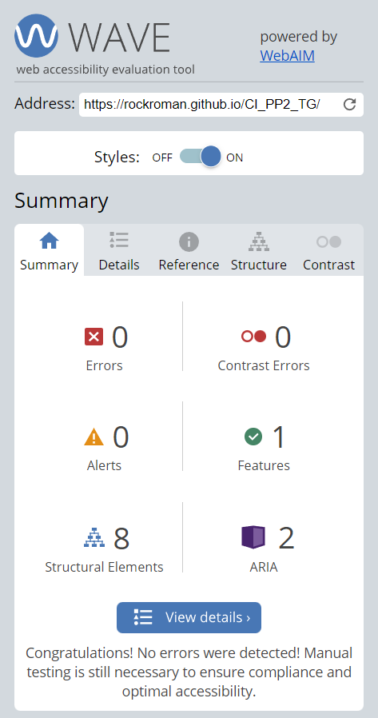

quiz-page

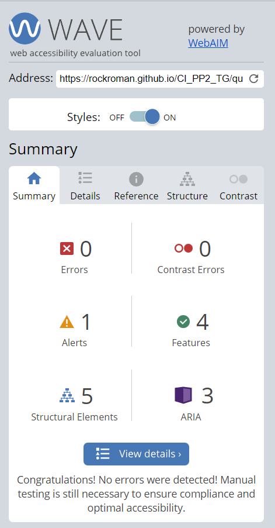

404-page

### Performance
I used Google Lighthouse in Google Chrome Developer Tools to test the performance of the project.

homepage-mobile

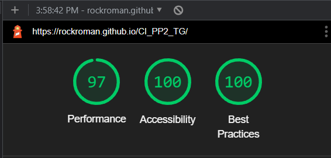

homepage-desktop

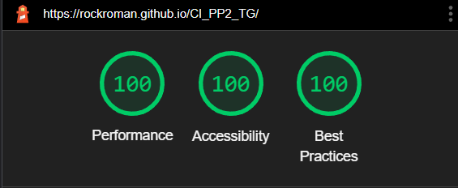

quiz-page-mobile

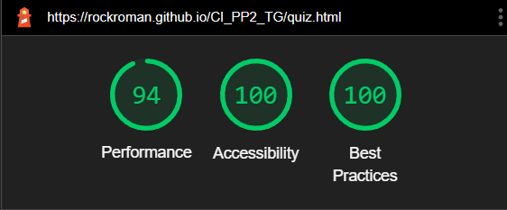

quiz-page-desktop

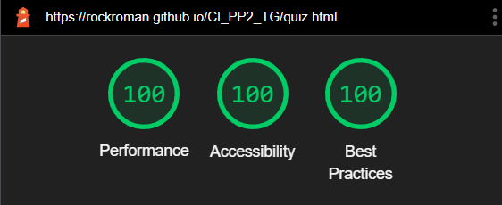

404.page-mobile

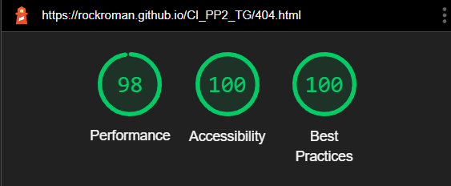

404.page-desktop

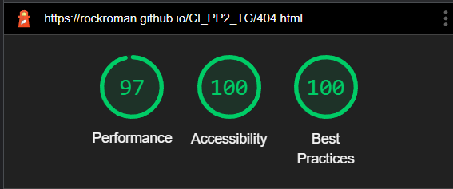

### Device testing
- Lenovo ideaPad3 14ADA05
- Samsung A52 5g
- Iphone 
- Huawei P20 Lite
- Ipad 2020
 
 ### Browser Compatability 
 - Project was developed in the Google Chrome browser and then tested in:
 - Microsoft Edge
 - Mozilla Firefox

 [Back to top &uarr;](#total-guitar)

 ### Testing user stories

 0. I want to understand what the game is about 

| **Feature**                     | **Action**                          | **Expected Result**                                                                  | **Actual Result** |
|---------------------------------|-------------------------------------|--------------------------------------------------------------------------------------|-------------------|
|Welcome pop up modal             | read the message on pop up window   | User has been informed about game content |working as expected|              
| Transition pop up modal         | read message and click to proceed    | User gets feedback and instruction to proceed with game|working as expected| 
|favicon|look and see what game theme is|User can prepare what content to expect|working as expected|

Screenshots

Screenshots

Screenshots

1. I want to game rules to be easy to understand

| **Feature**                     | **Action**                          | **Expected Result**                                                                  | **Actual Result** |
|---------------------------------|-------------------------------------|--------------------------------------------------------------------------------------|-------------------|
| Game rules modal                | Modal pops up to inform user about game rules| User gets information about rules and has option to start game| working as expected| 

Screenshots

2. I want to know the controls in a game

| **Feature**                     | **Action**                          | **Expected Result**                                                                  | **Actual Result** |
|---------------------------------|-------------------------------------|--------------------------------------------------------------------------------------|-------------------|
| Game rules modal                | Modal pops out for user to read the game controls| User gets inform how to play game| working as expected| 

Screenshots

3. I want to game to be fun and interactive

| **Feature**                     | **Action**                          | **Expected Result**                                                                  | **Actual Result** |
|---------------------------------|-------------------------------------|--------------------------------------------------------------------------------------|-------------------|
| Target                          | Click and hit the target|User get points for clicking on target|working as expected| 
| Custom cursor| Move around screen and aim the target|moves following the cursor movement|working as expected| 
| Hit detection | click on target| user gets feedback that target is hit when hit detection is showed on the screen|working as expected| 

Screenshots

Screenshots

Screenshots

4. I want to be able to see the progress Im making throughout the game

| **Feature**                     | **Action**                          | **Expected Result**                                                                  | **Actual Result** |
|---------------------------------|-------------------------------------|--------------------------------------------------------------------------------------|-------------------|
| header with game stats| Read and see the progress|Stats are constantly changing as user progresses through the game|working as expected| 
| quiz stats|Read and see the progress|Stats are constantly changing as user progresses through the game|working as expected| 

Screenshots

Screenshots

5. I want to game to be challenging

| **Feature**                     | **Action**                          | **Expected Result**                                                                  | **Actual Result** |
|---------------------------------|-------------------------------------|--------------------------------------------------------------------------------------|-------------------|
| 1st game main screen  | more clicks= more difficult the game| Game get more challenging with more clicks user makes|working as expected| 
| quiz game main screen| Random question pups up|User gets random questions|working as expected| 

Screenshots

Screenshots

6. I want to be able to get in touch with developer

| **Feature**                     | **Action**                          | **Expected Result**                                                                  | **Actual Result** |
|---------------------------------|-------------------------------------|--------------------------------------------------------------------------------------|-------------------|
|Footer|click on footer icon|User is taken to offered websites|working as expected| 
|Thank-you form | Fill the form|User can leave feedback|working as expected| 

Screenshots

Screenshots

7. I want to be able to leave feedback

| **Feature**                     | **Action**                          | **Expected Result**                                                                  | **Actual Result** |
|---------------------------------|-------------------------------------|--------------------------------------------------------------------------------------|-------------------|
|Thank-you form | Fill the form|User can leave feedback|working as expected|

Screenshots

8. I want to game to be responsive no matter what device is played on.

| **Feature**                     | **Action**                          | **Expected Result**                                                                  | **Actual Result** |
|---------------------------------|-------------------------------------|--------------------------------------------------------------------------------------|-------------------|
| Media queries usage |Change screen or device size|Everything is working no matter of screen size|working as expected|

Screenshots

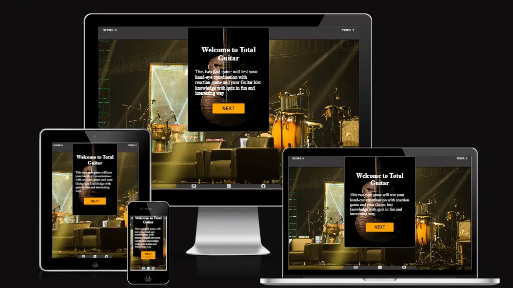

9. I want to learn something playing the game

| **Feature**                     | **Action**                          | **Expected Result**                                                                  | **Actual Result** |
|---------------------------------|-------------------------------------|--------------------------------------------------------------------------------------|-------------------|
|quiz game main screen|click on any answer| Right answer is highlighted green|working as expected|

Screenshots

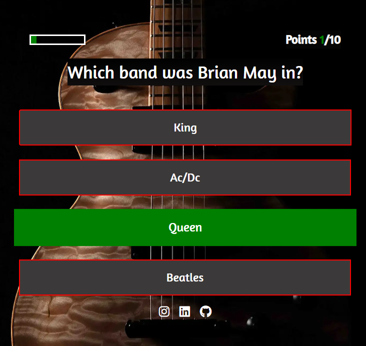

10. I want to be able to restart the game when I finish

| **Feature**                     | **Action**                          | **Expected Result**                                                                  | **Actual Result** |
|---------------------------------|-------------------------------------|--------------------------------------------------------------------------------------|-------------------|
| Game over modal|click the button to restart the game |Start game from beginning|working as expected|
| Thank-you form |click the button to restart the game |Start game from beginning|working as expected|
| end quiz btn| click the button| user is taken to a screen that allows restarting the game|working as expected|

Screenshots

Screenshots

Screenshots

11. I want game to be fast and dynamic so i can recommend it to my friends

| **Feature**                     | **Action**                          | **Expected Result**                                                                  | **Actual Result** |
|---------------------------------|-------------------------------------|--------------------------------------------------------------------------------------|-------------------|
|  Target                          | Click and hit the target|User get points for clicking on target|working as expected| 
| Custom cursor| Move around screen and aim the target|moves following the cursor movement|working as expected| 
|quiz game main screen|click on any answer| Right answer is highlighted green|working as expected|

Screenshots

Screenshots

Screenshots

12. I want to have more than one option to get in touch with developer

| **Feature**                     | **Action**                          | **Expected Result**                                                                  | **Actual Result** |
|---------------------------------|-------------------------------------|--------------------------------------------------------------------------------------|-------------------|
|footer | Click on footer icons|user is taken to chosen site|working as expected|

Screenshots

13. I want to know that my feedback has been sent

| **Feature**                     | **Action**                          | **Expected Result**                                                                  | **Actual Result** |
|---------------------------------|-------------------------------------|--------------------------------------------------------------------------------------|-------------------|
| Thank-you message | read about feedback |Notifies user that his feedback was successfully sent|working as expected|

Screenshots

[Back to top &uarr;](#total-guitar)

## Bugs

***
0. bug:jshint is reporting undefined variable 'emailjs' in contact.js file
- solution:since Emailjs is library and in the documents section it is explained how it's used and it's done a correct way but
still Jshint does report the same,after long Research the conclusion is that validator doesnt what the instance 'emailjs' is and 
report should be disregarded. 
  

Screenshots
 
   
  

1. bug: after game was over due to to many times target was missed,user could still hit the target and score
 - solution:after researching  i came to idea to not allow any more clicks on game field section

2. bug:target image created with javascript wasn't loading!!
 - solution image path was incorrect

3. bug: when setting welcome and start game screen display flex was overriding class hide that i made to put display none to element.
 - solution:solved bug with trial and error and removed display property from an id of element and put it to class of element.

4. bug:404 page footer was inheriting background color from footer on index html page
- solution: give unique id and apply style

5. bug: 404 main container wasn't covering entire page on mobile with height:100%
- solution: searching on  stack-overflow found solution in putting  element- height to 100vh

6. bug:missed one letter in namnig class of bootstrap container
- solution:with trial and error method spotted the mistake and  added  letter 

7. bug:thank you form button could be pressed even submitting the form
- solution: after going through Stackoverflow found solution in putting 'disabled attribute to button to be true.

8. bug: pressed quiz(bootstrap) button hover state would stayed active on IOS device.
- solution: going through Stackoverflow found out that is the common problem so I came to idea to put hover state color same as no hover state 

## Deployment

***
### Deploying on GitHub pages
The website was deployed using GitHub Pages by following these steps:
1. In the GitHub repository navigate to the Settings tab
2. On the left hand menu select Pages
3. For the source select Branch: main
4. Once saved, GitHub will refresh and your website will be published from GitHub repository
5. The link to your published website will appear: "Your site is published at https://rockroman.github.io/CI_PP2_TG/"

### Local Development

#### How to Fork
 to fork the project repository you can follow these steps:
 1. navigate to project GitHub repository [CI_PP2_TG](https://rockroman.github.io/CI_PP2_TG/)
 2. navigate to upper right hand corner to "fork" section button and click on it

 
 #### How to Clone

 1. Go to the GitHub repository 
2. Locate the Code button above the list of files and click it
3. Highlight the "HTTPS" button to clone with HTTPS and copy the link
4. Open Git Bash
5. Change the current working directory to the one where you want the cloned directory
6. Type git clone and paste the URL from the clipboard ($ git clone https://github.com/YOUR-USERNAME/YOUR-REPOSITORY)
7. Press Enter to create your local clone

[Back to top &uarr;](#total-guitar)

## Credits

***
### Media
Images:
- [homapage-img](assets/images/ashok-chakravarthi-orkJgUqIpio-unsplash-small.jpg): photo by <a href="https://unsplash.com/s/users/ashok-chakravarthi">Ashok chakravarthi </a> on <a href="https://unsplash.com/">unsplash</a>
- [welcome-modal-img and quiz game background](assets/images/welcome_guitar-maxime-favier-unsplash.webp): photo by <a href="https://unsplash.com/@maximefavier">Maxime favier </a> on <a href="https://unsplash.com/">unsplash</a>

- [Thank-you form](assets/images/thank-you2-jeremy-allouche-unsplash.webp): photo by <a href="https://unsplash.com/@jerroams">Jeremy Allouche
 </a> on <a href="https://unsplash.com/">unsplash</a>
- : photo by  on <a href="">Pexels</a>
- : photo by  on <a href="">Pexels</a>

### code:
 
- [this](https://www.youtube.com/watch?v=IMV-hf4JIK0) tutorial was used to make custom cursor follow cursor
- part of [this](https://www.youtube.com/watch?v=riDzcEQbX6k&t=1341s) tutorial was used to make quiz game 
- [this](https://www.youtube.com/watch?v=MxrGPP4F8Sc&t=2067s) tutorial was inspiration for quiz game 
- Emailjs [docs](https://www.emailjs.com/docs/) were used to connect thank you form to an Email
- [Stackoverflow](https://stackoverflow.com/) was used to research through development of project

[Back to top &uarr;](#total-guitar)
## Acknowledgments

***
I would like to take a few moments to say Thank you to following people:

- First i would like to thank my wife Una and my daughter Tara for continuous support and understanding while working on development of this project.
- I would like to thank my Mentor Mo.Shami for his support ,insight expertise and guidance.
- I would like to thank [Nemanja Manojlovic_alumni](https://github.com/Manojlovic1998) for excellent ideas and feedback  
- Awesome Code Institute Slack community for being there